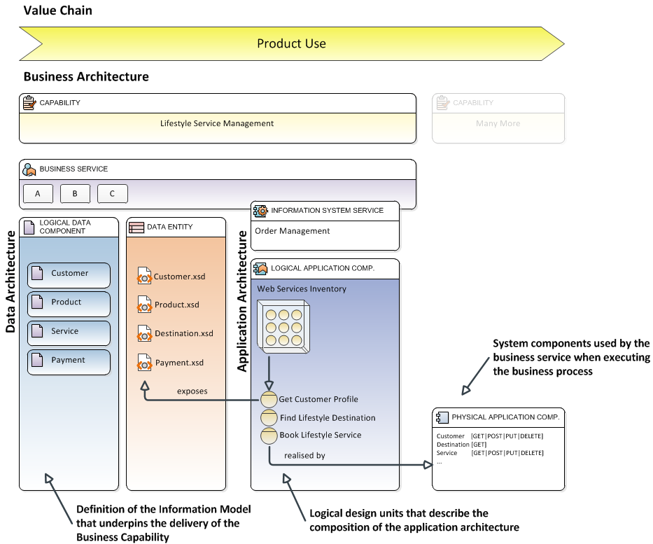
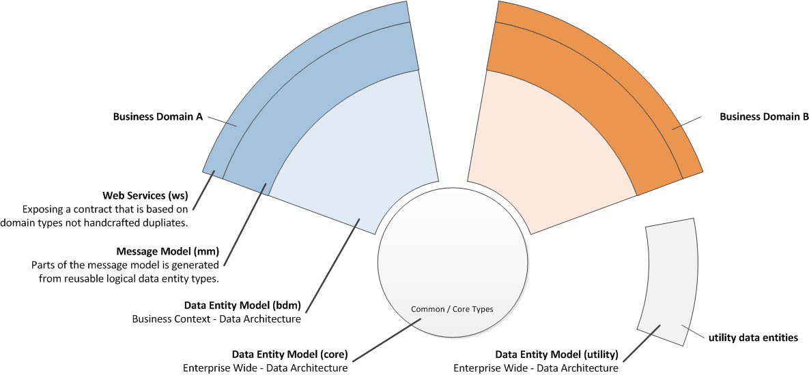

# Design Builder

## Overview

While working as an enterprise or information architect, did you ever wondered how to actually break down and distribute a information model after investing uncounted hours researching and documenting? We looked for a practical answer for a long time without much luck.

Our mission was to take the information model from business architecture to physical application component with a mandatory requirement to allow us to evolve the business process yet be able to maintain physical information assets and system interfaces.

The following diagram attempts to outline this approach:   



Model driven architecture and model driven design you say, sure ... there are solutions from major vendors you may add, absolutely! We thought so as well but after spending obscene amounts of time and money on a number of tools we could not make any of them work in practice. One was too abstract, the other no proper model version control, a third strutted a broken deppendency model and multiple others had more useful marketing material than the actual software itself.    

## Model Components

Lets break down the components of how such a model typically looks like.




## Mapping Design to Physical Model

There are many options available to design the actual data model and service contracts. We use XML Schema and OxygenXML one of the best XML authoring tools around to build data models. This gives us very powerful design capabilites and supports the packaging of the design assets and later code generation. During the design process we simply create schema models aligned to business capabilities and then use standard source control and maven release and dependency management functions to package and distribute our physical model contracts, fine grained service versioning and mutli service version support included.  


## Design Builder Plugin

So what's with this plugin? Simple, this plugin will support the design tool and packaging process to turn a XML Schema based data model into distributable components.

```xml
<plugin>
  <groupId>io.fares.maven.plugins</groupId>
  <artifactId>design-builder-maven-plugin</artifactId>
  <version>0.1.6</version>
  <executions>
    <!-- flatten the XSDL resource into the target output directory -->
    <execution>
      <id>flatten-wsdl</id>
      <phase>generate-sources</phase>
      <goals>
        <goal>flatten</goal>
      </goals>
      <configuration>
        <verbose>true</verbose>
        <sourceDirectory>${project.baseDir}/src/main/wsdl</sourceDirectory>
        <includes>
          <include>**/*.wsdl</include>
        </includes>
        <scanDependencies>true</scanDependencies>
        <catalogFilter>(.*\.cat)|(.*catalog\.xml)</catalogFilter>
        <outputDirectory>${project.build.directory}/generated-sources/wsdl</outputDirectory>
      </configuration>
    </execution>
    <execution>
      <!-- this execution will ensure a catalog.xml file is packaged with the release bundle -->
      <id>generate-release-catalog</id>
      <phase>process-resources</phase>
      <goals>
        <goal>catalog</goal>
      </goals>
      <configuration>
        <sourceDirectory>${project.build.directory}/generated-sources/wsdl</sourceDirectory>
        <targetCatalogFile>${project.build.outputDirectory}/META-INF/catalog.cat</targetCatalogFile>
        <includes>
          <include>**/*.xsd</include>
        </includes>
        <verbose>true</verbose>
        <catalog>
          <prefer>public</prefer>
          <public>
            <appendSchemaFile>true</appendSchemaFile>
          </public>
          <system>
            <appendSchemaFile>true</appendSchemaFile>
          </system>
          <systemSuffix>
            <pathOffset>0</pathOffset>
          </systemSuffix>
        </catalog>
      </configuration>
    </execution>
  </executions>
</plugin>
```

### Design Catalog

Generates a catalog file that can be used with XML schema design tools to locate work in progress.  


### Dependency Collection and Packaging 

Flatten plugin will process all imports and includes recursively and place all files into a single target directory.


### Limitations

the catalog generator currently only supports system suffix catalogs

### TODO

* [X] needs better unit tests
* [ ] implement mojo that will generate catalog with classpath reference (see [CXF catalog example](https://labs.bsb.com/2011/01/usage-of-an-xml-catalog-in-the-xmlbeans-cxf-integration/))  
